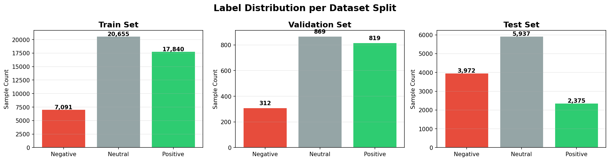
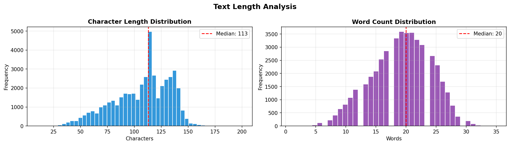
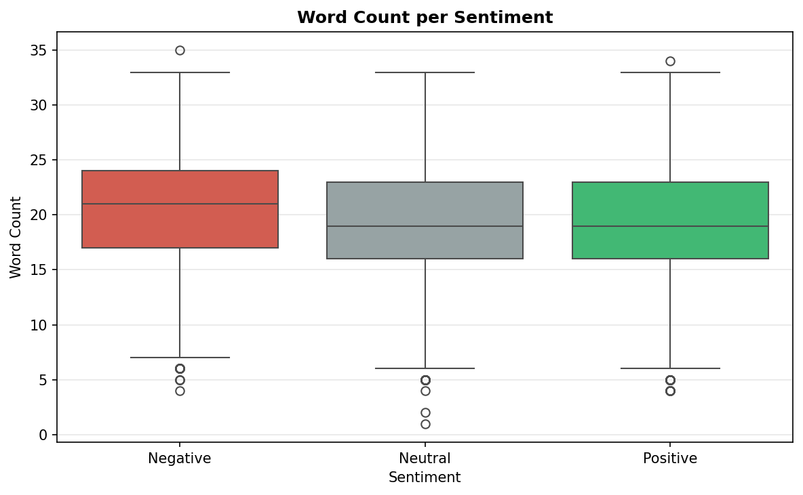
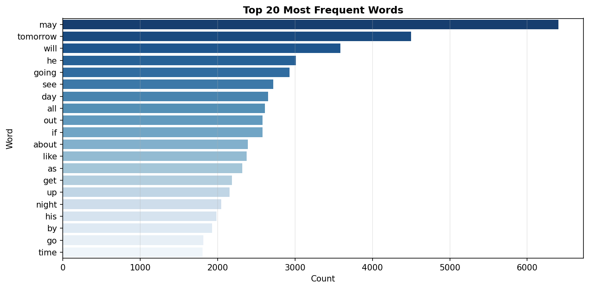
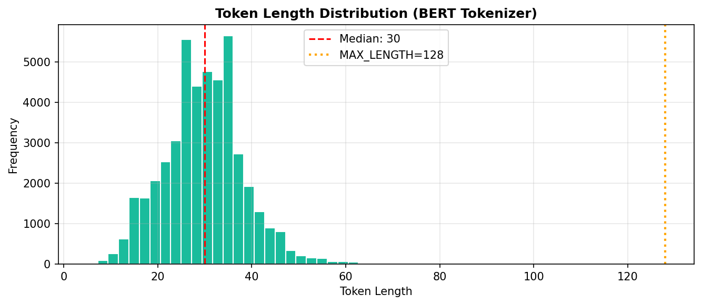
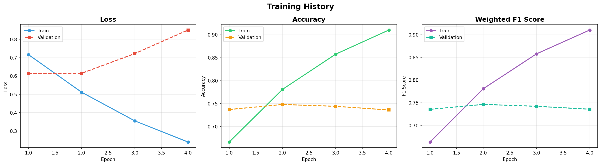
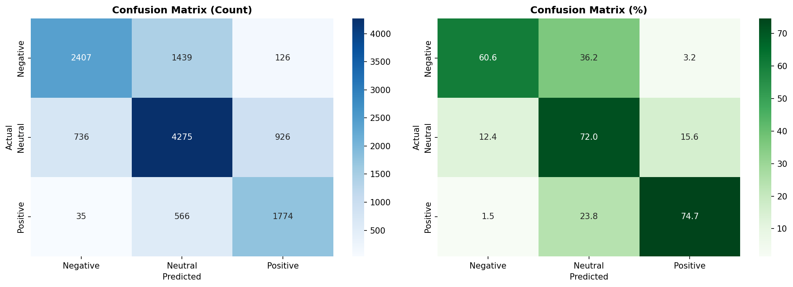
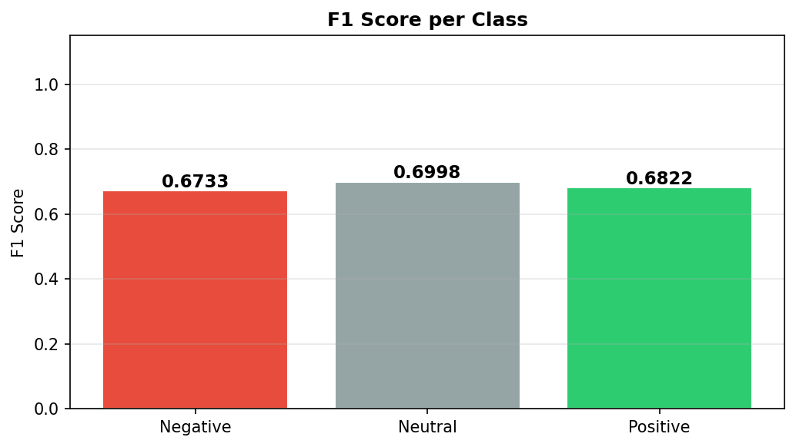
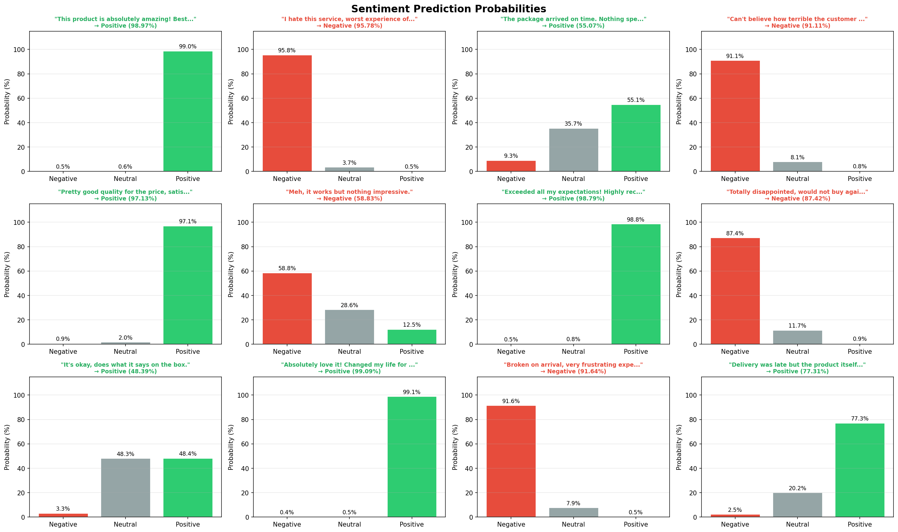

# 🤖 Sentiment Analysis using BERT + HuggingFace (PyTorch)


A complete NLP pipeline for 3-class tweet sentiment classification (Negative / Neutral / Positive) using a fine-tuned `bert-base-uncased` model on the `tweet_eval/sentiment` dataset.

---

## 🔍 Overview

This project implements a **BERT-based sentiment analysis** model to classify tweets into three sentiment categories:

| Label | Class |
|-------|-------|
| 0 | Negative |
| 1 | Neutral |
| 2 | Positive |

The pipeline covers the full machine learning workflow: data exploration, preprocessing, tokenization, model fine-tuning, evaluation, error analysis, and inference visualization.

**Key Technologies:** PyTorch · HuggingFace Transformers · HuggingFace Datasets · scikit-learn · Seaborn · Matplotlib

---

## 🗂️ Dataset

**Source:** [`tweet_eval`](https://huggingface.co/datasets/tweet_eval) — `sentiment` subset (HuggingFace Datasets)

| Split | Samples |
|-------|---------|
| Train | 45,615 (→ 45,586 after dedup) |
| Validation | 2,000 |
| Test | 12,284 |

### 📊 Label Distribution



The dataset is **imbalanced** — Neutral tweets dominate all splits, especially in the test set (5,937 Neutral vs 3,972 Negative and 2,375 Positive).

---

## 🔬 Exploratory Data Analysis

### 📏 Text Length Statistics (Train Set)

| Metric | Characters | Words |
|--------|-----------|-------|
| Mean | 106.94 | 19.24 |
| Median | 113 | 20 |
| Std | 26.25 | 4.94 |
| Min | 10 | 1 |
| Max | 200 | 35 |

**Shortest tweet:** `#AmWriting`  
**Longest tweet:** *"This is as brutal of a loss as it gets. Up 6-0 then up 2 with 2 outs in the 9th only to blow it. It's going to be a very long winter in WSH."*



The character length distribution shows a bimodal pattern, with many tweets near the Twitter character limit (~140 chars). Word count peaks around 19–20 words.

### 💬 Word Count per Sentiment



Word count distributions are largely similar across sentiment classes (all centered around 19–21 words), confirming that **length alone is not a strong signal** for sentiment.

### 🔤 Top 20 Most Frequent Words



After stopword removal, the most frequent terms include temporal words like *"may"* and *"tomorrow"*, and action words like *"will"*, *"going"*, *"see"* — reflecting the conversational and event-driven nature of tweet content.

### 🪙 Token Length Analysis (BERT Tokenizer)



| Metric | Value |
|--------|-------|
| Median token length | 30 |
| Sequences > 128 tokens | Very few |
| MAX_LENGTH setting | 128 |

The vast majority of tweets fall well below the 128-token limit, meaning **truncation is rarely needed** and the chosen `MAX_LENGTH=128` is appropriate with minimal information loss.

---

## 🏗️ Model Architecture

**Base model:** `bert-base-uncased` (110M parameters)  
**Task head:** Linear classification layer → 3 output logits  
**Loss function:** Cross-entropy (built into `BertForSequenceClassification`)

```
BertForSequenceClassification
├── BertModel (bert-base-uncased)
│   ├── BertEmbeddings
│   ├── BertEncoder (12 transformer layers)
│   └── BertPooler
└── Classifier: Linear(768 → 3)
```

### ⚙️ Optimizer: AdamW with Differential Learning Rates

| Parameter Group | Learning Rate |
|-----------------|--------------|
| BERT encoder (with weight decay) | 2e-5 |
| BERT encoder (bias & LayerNorm) | 2e-5, wd=0 |
| Classifier head | 2e-4 (10× higher) |

This strategy allows the classifier head to adapt quickly while preserving BERT's pretrained representations.

### 📈 Scheduler

Linear warmup → linear decay over total training steps, with 10% warmup ratio.

---

## ⚙️ Training Configuration

| Hyperparameter | Value |
|---------------|-------|
| Model | bert-base-uncased |
| Max Sequence Length | 128 |
| Batch Size | 32 |
| Epochs | 4 |
| Learning Rate | 2e-5 |
| Weight Decay | 0.01 |
| Warmup Ratio | 0.1 |
| Early Stopping Patience | 2 |
| Gradient Clipping | max_norm=1.0 |
| Seed | 42 |

### 📉 Training History



The training curves reveal a classic **overfitting pattern**:
- Training loss decreases steadily across all 4 epochs
- Validation loss begins to increase after epoch 2, indicating the model memorizes training patterns
- Validation accuracy and F1 plateau around epoch 2 (~0.74–0.75), while training metrics continue to rise
- The best validation F1 was achieved at **epoch 2** (0.7463), and early stopping was not triggered since all 4 epochs completed

---

## 📊 Results

### 🏆 Test Set Performance

| Metric | Value |
|--------|-------|
| **Test Accuracy** | **68.84%** |
| **Test F1 Score (Weighted)** | **0.6878** |
| Test Loss | 0.6959 |
| Best Validation F1 | 0.7463 |

### 📋 Classification Report

| Class | Precision | Recall | F1-Score | Support |
|-------|-----------|--------|----------|---------|
| Negative | 0.7574 | 0.6060 | 0.6733 | 3,972 |
| Neutral | 0.6807 | 0.7201 | 0.6998 | 5,937 |
| Positive | 0.6277 | 0.7469 | 0.6822 | 2,375 |
| **Weighted avg** | **0.6953** | **0.6884** | **0.6878** | **12,284** |

### 🔲 Confusion Matrix



Key observations from the confusion matrix:
- **Neutral** is the best-classified class (72.0% recall), benefiting from its larger representation
- **Positive** has the highest recall (74.7%) but lowest precision (62.8%), indicating many false positives
- **Negative** is frequently confused with Neutral (36.2% misclassified as Neutral), a common challenge since negative tweets often contain hedging language

### 🎯 F1 Score per Class



F1 scores are relatively balanced across classes (0.67–0.70), suggesting the model has not severely collapsed toward any single class despite class imbalance.

---

## ❌ Error Analysis

**Total misclassified:** 3,828 / 12,284 (31.2%)

| Error Type | Count |
|-----------|-------|
| Negative → Neutral | 1,439 |
| Neutral → Positive | 926 |
| Neutral → Negative | 736 |
| Positive → Neutral | 566 |
| Negative → Positive | 126 |
| Positive → Negative | 35 |

The most common error is **Negative being classified as Neutral** (1,439 cases), which aligns with the general difficulty of distinguishing subtle negativity from neutral tone in short texts. The rarest error is **Positive → Negative** (only 35 cases), confirming that strongly positive and negative sentiments are rarely confused with each other.

### 🔎 Example Misclassifications

| Text | True | Predicted |
|------|------|-----------|
| *"@user @user what do these '1/2 naked pics' have to do with anything?..."* | Neutral | Negative |
| *"OH: 'I had a blue penis while I was this' [playing with Google Earth VR]"* | Neutral | Positive |
| *"@user Wow, first Hugo Chavez and now Fidel Castro. Danny Glover, Michael Moore..."* | Negative | Neutral |

These examples highlight the challenge of **context-dependent and ironic language** in tweets, where surface-level word choice is insufficient without broader world knowledge.

---

## 🔮 Inference

The model supports batch inference with per-class probability output.

### 📊 Sample Inference Results



The model performs well on clearly polarized texts (e.g., 99% confidence for "This product is absolutely amazing!") but shows more uncertainty on ambiguous cases (e.g., near 50/50 split for "It's okay, does what it says on the box.").

### 🔧 Inference Function Signature

```python
predict_sentiment(
    texts: List[str],
    model: BertForSequenceClassification,
    tokenizer: BertTokenizerFast,
    device: torch.device,
    max_length: int = 128,
    batch_size: int = 16
) -> pd.DataFrame
```

**📤 Output columns:** `text`, `predicted_label`, `label_name`, `confidence (%)`, `prob_negative`, `prob_neutral`, `prob_positive`

---

## 📁 Project Structure

```
├── bert_sentiment_analysis.ipynb   # Main notebook
├── best_model.pt                   # Best model checkpoint (by val F1)
├── saved_model/                    # HuggingFace-format saved model
│   ├── config.json
│   ├── tokenizer_config.json
│   └── pytorch_model.bin
├── training_history.csv            # Per-epoch metrics
├── images/plot_01_label_distribution.png
├── images/plot_02_length_distribution.png
├── images/plot_03_wordcount_per_sentiment.png
├── images/plot_04_top_words.png
├── images/plot_05_token_length.png
├── images/plot_06_training_history.png
├── images/plot_07_confusion_matrix.png
├── images/plot_08_f1_per_class.png
└── images/plot_09_inference_results.png
```

---

## 📦 Requirements

```bash
pip install transformers datasets torch torchmetrics scikit-learn matplotlib seaborn tqdm accelerate
```

| Package | Purpose |
|---------|---------|
| `torch` | Deep learning framework |
| `transformers` | BERT model & tokenizer |
| `datasets` | HuggingFace dataset loading |
| `scikit-learn` | Metrics (F1, accuracy, confusion matrix) |
| `matplotlib` / `seaborn` | Visualization |
| `tqdm` | Progress bars |
| `accelerate` | Training acceleration |

**🖥️ Hardware:** GPU strongly recommended (tested on CUDA). Falls back to CPU automatically.

---

## 🚀 Usage

### 1️⃣ Run the Full Pipeline

Open and run `bert_sentiment_analysis.ipynb` in Google Colab or a local Jupyter environment with GPU access.

### 2️⃣ Load the Saved Model for Inference

```python
from transformers import BertTokenizerFast, BertForSequenceClassification
import torch

SAVE_DIR = "./saved_model"
tokenizer = BertTokenizerFast.from_pretrained(SAVE_DIR)
model = BertForSequenceClassification.from_pretrained(SAVE_DIR)
model.eval()

device = torch.device("cuda" if torch.cuda.is_available() else "cpu")
model = model.to(device)

# Run inference
results = predict_sentiment(
    ["This product is fantastic!", "Terrible experience, never again."],
    model, tokenizer, device
)
print(results[["text", "label_name", "confidence"]])
```

---

## ✅ Conclusion

This project successfully demonstrates a complete BERT fine-tuning pipeline for tweet sentiment analysis. The model achieves **68.84% accuracy** and **0.6878 weighted F1** on the test set, with relatively balanced per-class performance (F1 ranging from 0.67 to 0.70).

The training history reveals clear overfitting after epoch 2, with the best generalization captured at the validation F1 peak of **0.7463**. The primary source of error is the Negative→Neutral boundary, which is linguistically challenging due to sarcasm, hedging, and implicit negativity common in social media text.

**💼 Business applications** include brand monitoring, customer feedback classification, and real-time social media analytics.

---

## 🚧 Future Improvements

- **🔄 Stronger pretrained model:** RoBERTa, DeBERTa, or Twitter-specific BERT (e.g., `bertweet-base`)
- **⏹️ Early stopping:** Halt at best validation F1 to avoid overfitting (would save at epoch 2)
- **⚖️ Class balancing:** Weighted loss function or oversampling to address Neutral class dominance
- **🔁 Data augmentation:** Back-translation or synonym replacement to improve minority class coverage
- **🔍 Hyperparameter search:** Grid/random search over learning rate, batch size, and dropout
- **🌐 Deployment:** Wrap model in a FastAPI or Gradio app for real-time inference

---

## 📄 License

This project is for educational and research purposes. The `tweet_eval` dataset is publicly available via HuggingFace Datasets under its respective license.
